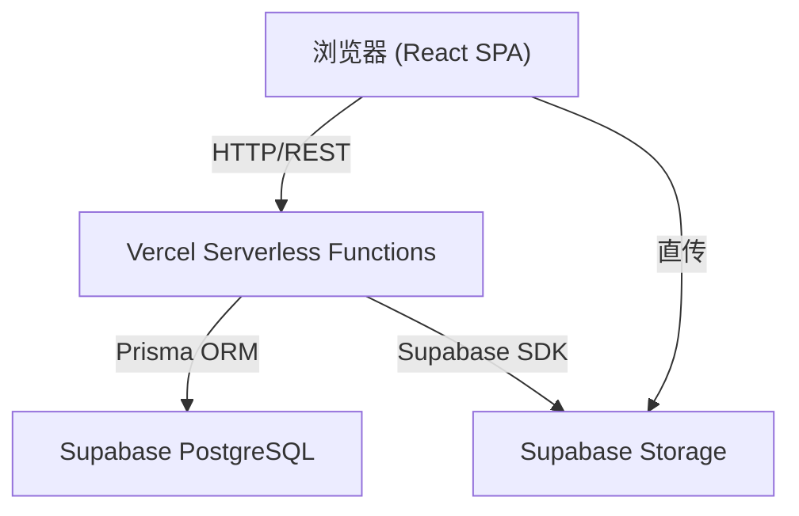
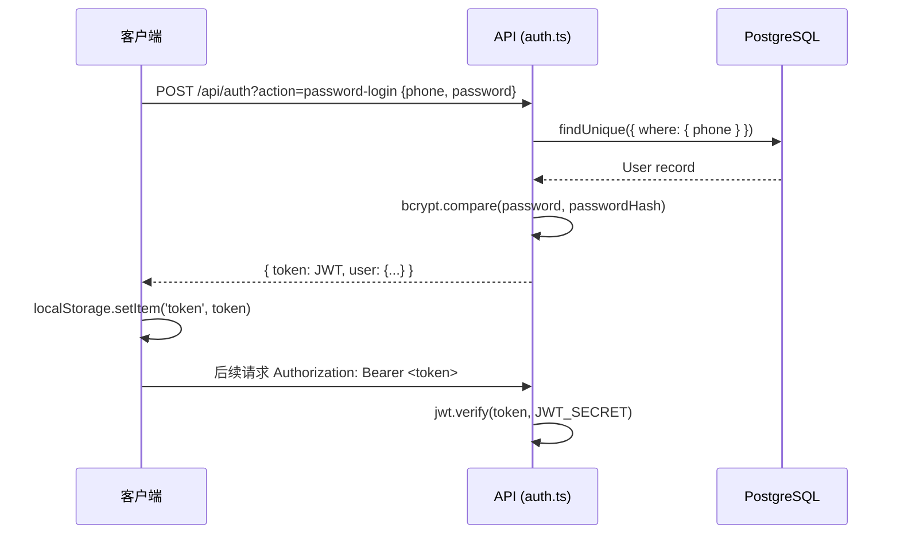
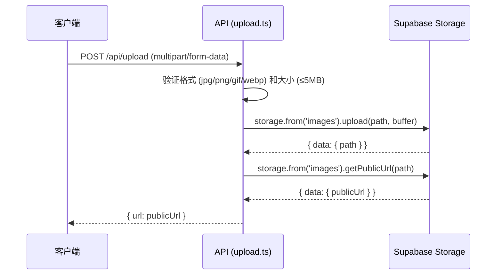

# 技术设计文档：应用简化重构

## 概述

本文档描述将现有复杂教育问答应用简化为精简版本的技术设计方案。简化后的系统保留核心功能：问题管理、回答、评论、图片上传，以及科目/考点分类体系。删除所有不必要的表、字段、路由和组件。

技术栈：React + TypeScript + Vite（前端）、Vercel Serverless Functions（API）、Supabase PostgreSQL + Storage（数据库和文件存储）、Prisma ORM、Radix UI + Tailwind CSS。

## 架构

系统采用前后端分离架构，前端为 SPA（Single Page Application），后端为 Vercel Serverless Functions，数据库使用 Supabase 托管的 PostgreSQL。



### 认证流程



### 图片上传流程



## 组件与接口

### 前端路由结构

简化后只保留以下路由：

| 路由 | 组件 | 访问权限 |
|------|------|----------|
| `/` | `HomePage` | 公开（游客可访问） |
| `/login` | `LoginPage` | 公开 |
| `/create` | `CreateQuestionPage` | 需要登录（admin/teacher） |
| `/edit/:id` | `CreateQuestionPage` | 需要登录，且为作者 |
| `/question/:id` | `QuestionDetailPage` | 公开 |
| `/answer/:id` | `AnswerQuestionPage` | 需要登录 |
| `/admin/subjects` | `AdminSubjectsPage` | 需要 admin 角色 |

所有已删除路由（`/profile`, `/audit`, `/admin`, `/my-questions` 等）重定向到 `/`。

### API 端点设计

所有 API 均为 Vercel Serverless Functions，位于 `api/` 目录。

#### 认证 API (`api/auth.ts`)

| 方法 | 路径 | 描述 | 权限 |
|------|------|------|------|
| POST | `/api/auth?action=password-login` | 密码登录 | 公开 |

请求体：`{ phone: string, password: string }`

响应：`{ code: 200, data: { token: string, user: UserDTO } }`

#### 问题 API (`api/questions.ts`)

| 方法 | 路径 | 描述 | 权限 |
|------|------|------|------|
| GET | `/api/questions` | 获取问题列表（分页、筛选、搜索） | 公开 |
| POST | `/api/questions` | 创建问题 | 需要登录 |
| GET | `/api/questions?id=:id` | 获取问题详情 | 公开 |
| PUT | `/api/questions?id=:id` | 修改问题 | 需要登录，且为作者 |

GET 列表查询参数：`page`, `pageSize`, `subject`, `topic`, `search`

POST/PUT 请求体：
```typescript
{
  title: string        // 必填，最多100字
  content?: string     // 可选，最多500字
  subject: string      // 必填，Subject.key
  tags?: string[]      // 考点 value 数组
  images?: string[]    // 图片URL数组，最多3张
}
```

#### 回答 API (`api/answers.ts`)

| 方法 | 路径 | 描述 | 权限 |
|------|------|------|------|
| GET | `/api/answers?questionId=:id` | 获取问题的所有回答 | 公开 |
| POST | `/api/answers` | 创建回答 | 需要登录 |

POST 请求体：
```typescript
{
  questionId: string   // 必填
  content: string      // 必填
  images?: string[]    // 图片URL数组
}
```

#### 评论 API (`api/comments.ts`)

| 方法 | 路径 | 描述 | 权限 |
|------|------|------|------|
| GET | `/api/comments?questionId=:id` | 获取问题的所有评论 | 公开 |
| POST | `/api/comments` | 创建评论 | 需要登录 |

POST 请求体：
```typescript
{
  questionId: string   // 必填
  content: string      // 必填
  image?: string       // 单张图片URL，可选
}
```

#### 科目/考点 API (`api/subjects.ts`)

| 方法 | 路径 | 描述 | 权限 |
|------|------|------|------|
| GET | `/api/subjects` | 获取所有启用的科目 | 公开 |
| POST | `/api/subjects` | 创建科目 | admin |
| PUT | `/api/subjects?id=:id` | 修改科目 | admin |
| DELETE | `/api/subjects?id=:id` | 删除科目 | admin |
| GET | `/api/subjects?key=:key&topics=1` | 获取科目下的考点 | 公开 |
| POST | `/api/subjects?topics=1` | 创建考点 | admin |
| PUT | `/api/subjects?topicId=:id` | 修改考点 | admin |
| DELETE | `/api/subjects?topicId=:id` | 删除考点 | admin |

#### 图片上传 API (`api/upload.ts`)

| 方法 | 路径 | 描述 | 权限 |
|------|------|------|------|
| POST | `/api/upload` | 上传图片到 Supabase Storage | 需要登录 |

请求：`multipart/form-data`，字段名 `file`

响应：`{ url: string }`

### 可复用 UI 组件接口

#### 1. QuestionCard

```typescript
interface QuestionCardProps {
  question: {
    id: string
    title: string
    content?: string
    subject?: string
    tags?: string[]
    images?: string[]
    authorName: string
    authorAvatar?: string
    createdAt: string
    answerCount?: number
  }
  onClick?: (id: string) => void
}
```

#### 2. QuestionDetail

```typescript
interface QuestionDetailProps {
  question: QuestionDTO
  answers: AnswerDTO[]
  comments: CommentDTO[]
  onAnswer?: () => void
  onComment?: () => void
}
```

#### 3. AnswerCard

```typescript
interface AnswerCardProps {
  answer: {
    id: string
    content: string
    images?: string[]
    authorName: string
    authorAvatar?: string
    createdAt: string
  }
  onComment?: (answerId: string) => void
}
```

#### 4. CommentCard

```typescript
interface CommentCardProps {
  comment: {
    id: string
    content: string
    image?: string
    authorName: string
    authorAvatar?: string
    createdAt: string
  }
}
```

#### 5. ImageUploader

```typescript
interface ImageUploaderProps {
  maxCount?: number          // 默认 3
  value?: string[]           // 已上传图片URL列表
  onChange?: (urls: string[]) => void
  disabled?: boolean
}
```

#### 6. SubjectTopicSelector

```typescript
interface SubjectTopicSelectorProps {
  subjectValue?: string      // 当前选中的 Subject.key
  topicValue?: string        // 当前选中的 Topic.value
  onSubjectChange?: (key: string) => void
  onTopicChange?: (value: string) => void
  required?: boolean
}
```

#### 7. QuestionFilter

```typescript
interface QuestionFilterProps {
  subject?: string
  topic?: string
  search?: string
  onFilterChange?: (filters: { subject?: string; topic?: string; search?: string }) => void
}
```

#### 8. ImageGallery

```typescript
interface ImageGalleryProps {
  images: string[]
  maxVisible?: number        // 默认全部显示
}
```

#### 9. SubjectManager

```typescript
interface SubjectManagerProps {
  onSubjectSelect?: (subjectKey: string) => void
}
```

#### 10. TopicManager

```typescript
interface TopicManagerProps {
  subjectKey: string
}
```

#### 11. SubjectForm

```typescript
interface SubjectFormProps {
  initialData?: Partial<SubjectDTO>
  onSubmit: (data: SubjectFormData) => Promise<void>
  onCancel?: () => void
}

interface SubjectFormData {
  key: string
  name: string
  description?: string
  order: number
  enabled: boolean
}
```

#### 12. TopicForm

```typescript
interface TopicFormProps {
  subjectKey: string
  initialData?: Partial<TopicDTO>
  onSubmit: (data: TopicFormData) => Promise<void>
  onCancel?: () => void
}

interface TopicFormData {
  value: string
  label: string
  order: number
  enabled: boolean
}
```

## 数据模型

### 简化后的 Prisma Schema

保留 6 个表，删除其余所有表。

```prisma
model User {
  id           String   @id @default(cuid())
  phone        String   @unique
  name         String?
  nickname     String
  avatar       String?
  role         String   // 'admin' | 'teacher'
  passwordHash String?
  createdAt    DateTime @default(now())
  updatedAt    DateTime @updatedAt

  @@index([phone])
  @@index([role])
}

model Question {
  id           String    @id @default(cuid())
  title        String    // 最多100字
  content      String?   // 最多500字
  subject      String?   // Subject.key
  tags         String[]  // Topic.value 数组
  images       String[]  // 图片URL数组，最多3张
  authorId     String
  authorName   String
  authorAvatar String?
  createdAt    DateTime  @default(now())
  updatedAt    DateTime  @updatedAt

  commentList  Comment[]
  answerList   Answer[]

  @@index([subject, createdAt])
  @@index([createdAt])
}

model Answer {
  id           String   @id @default(cuid())
  questionId   String
  question     Question @relation(fields: [questionId], references: [id], onDelete: Cascade)
  content      String
  images       String[]
  authorId     String
  authorName   String
  authorAvatar String?
  createdAt    DateTime @default(now())
  updatedAt    DateTime @updatedAt

  @@index([questionId, createdAt])
}

model Comment {
  id           String   @id @default(cuid())
  questionId   String
  question     Question @relation(fields: [questionId], references: [id], onDelete: Cascade)
  content      String
  image        String?
  authorId     String
  authorName   String
  authorAvatar String?
  createdAt    DateTime @default(now())
  updatedAt    DateTime @updatedAt

  @@index([questionId, createdAt])
}

model Subject {
  id          String   @id @default(cuid())
  key         String   @unique
  name        String
  order       Int      @default(0)
  enabled     Boolean  @default(true)
  description String?
  createdAt   DateTime @default(now())
  updatedAt   DateTime @updatedAt

  topics      Topic[]
}

model Topic {
  id         String   @id @default(cuid())
  subjectKey String
  value      String
  label      String
  order      Int      @default(0)
  enabled    Boolean  @default(true)
  createdAt  DateTime @default(now())
  updatedAt  DateTime @updatedAt

  subject    Subject  @relation(fields: [subjectKey], references: [key], onDelete: Cascade)

  @@index([subjectKey])
  @@unique([subjectKey, value])
}
```

### DTO 类型定义

```typescript
// 前端使用的数据传输对象
interface UserDTO {
  id: string
  phone: string
  nickname: string
  name?: string
  avatar?: string
  role: string
}

interface QuestionDTO {
  id: string
  title: string
  content?: string
  subject?: string
  tags?: string[]
  images?: string[]
  authorId: string
  authorName: string
  authorAvatar?: string
  createdAt: string
  updatedAt: string
  answerCount?: number
}

interface AnswerDTO {
  id: string
  questionId: string
  content: string
  images?: string[]
  authorId: string
  authorName: string
  authorAvatar?: string
  createdAt: string
  updatedAt: string
}

interface CommentDTO {
  id: string
  questionId: string
  content: string
  image?: string
  authorId: string
  authorName: string
  authorAvatar?: string
  createdAt: string
  updatedAt: string
}

interface SubjectDTO {
  id: string
  key: string
  name: string
  order: number
  enabled: boolean
  description?: string
}

interface TopicDTO {
  id: string
  subjectKey: string
  value: string
  label: string
  order: number
  enabled: boolean
}
```

### 科目和考点管理实现方案

科目（Subject）和考点（Topic）通过 `api/subjects.ts` 统一管理。前端 `/admin/subjects` 页面由 `SubjectManager` 和 `TopicManager` 组件组成，采用主从布局：左侧显示科目列表，右侧显示选中科目的考点列表。

删除保护逻辑：
- 删除科目前，检查 `Question.subject = subjectKey` 的记录数量，以及 `Topic.subjectKey = subjectKey` 的记录数量
- 删除考点前，检查 `Question.tags` 数组中包含该 `topic.value` 的记录数量
- 若存在关联数据，返回 409 错误并提示


## 正确性属性

*属性（Property）是在系统所有有效执行中都应成立的特征或行为——本质上是对系统应该做什么的形式化陈述。属性是人类可读规范与机器可验证正确性保证之间的桥梁。*

### Property 1: 游客访问控制

*For any* 未携带 Authorization 头的 GET 请求（问题列表、问题详情、回答列表、评论列表），系统应返回 200 而非 401/403；对于任意未携带 Authorization 头的写操作请求（POST/PUT），系统应返回 401。

**Validates: Requirements 1.1, 1.2**

### Property 2: 问题创建输入验证

*For any* 问题创建请求，若标题为空、标题超过100字、内容超过500字、未提供 subject 字段，或 images 数组长度超过3，系统应拒绝该请求并返回 400。

**Validates: Requirements 2.1, 2.2, 2.3, 2.5**

### Property 3: 问题数据持久化 Round Trip

*For any* 合法的问题创建请求，创建后立即查询该问题，返回的数据应与创建时提交的数据一致（title、content、subject、tags、images 字段值相等）。对问题执行修改操作后，再次查询应返回修改后的值。

**Validates: Requirements 2.6, 2.8**

### Property 4: 回答内容验证与持久化

*For any* 回答创建请求，若 content 为空，系统应返回 400；若 content 非空，创建后查询该问题的回答列表，应包含刚创建的回答，且内容与提交值一致。

**Validates: Requirements 3.3, 3.5**

### Property 5: 评论内容验证与持久化

*For any* 评论创建请求，若 content 为空，系统应返回 400；若 content 非空，创建后查询该问题的评论列表，应包含刚创建的评论，且内容与提交值一致。

**Validates: Requirements 4.3, 4.5**

### Property 6: 科目和考点查询完整性

*For any* 已插入数据库的启用科目集合，GET /api/subjects 返回的列表应包含所有 enabled=true 的科目。对于任意科目 key，GET /api/subjects?key=:key&topics=1 返回的考点列表应只包含 subjectKey 等于该 key 的考点。

**Validates: Requirements 5.3, 5.4**

### Property 7: 问题列表筛选正确性

*For any* 问题列表查询，若指定 subject 参数，返回的所有问题的 subject 字段应等于该参数值；若指定 topic 参数，返回的所有问题的 tags 数组应包含该参数值。

**Validates: Requirements 5.6, 5.7**

### Property 8: 图片上传验证

*For any* 图片上传请求，若文件格式不在 {jpg, jpeg, png, gif, webp} 中，或文件大小超过 5MB，系统应返回 400；若格式和大小均合法，系统应返回包含有效 URL 字符串的响应。

**Validates: Requirements 6.1, 6.2, 6.3**

### Property 9: 问题列表排序与分页

*For any* 问题列表查询，返回的问题应按 createdAt 降序排列（相邻两项满足 items[i].createdAt >= items[i+1].createdAt）。对于任意 page 和 pageSize 参数，不同页的问题 id 集合应不相交。

**Validates: Requirements 7.1, 7.5**

### Property 10: 问题搜索相关性

*For any* 带 search 参数的问题列表查询，返回的所有问题应满足：title 包含搜索词 OR content 包含搜索词。

**Validates: Requirements 7.6**

### Property 11: 科目/考点删除保护

*For any* 存在关联问题或考点的科目，尝试删除该科目时系统应返回 409；对于任意存在关联问题的考点，尝试删除时系统应返回 409。对于无关联数据的科目/考点，删除后查询应不再返回该记录。

**Validates: Requirements 10.8, 10.10, 10.19, 10.21**

### Property 12: Admin 权限控制

*For any* 非 admin 角色的用户 token，访问 POST/PUT/DELETE /api/subjects 端点时，系统应返回 403。

**Validates: Requirements 11.5**

## 错误处理

### API 错误响应格式

所有 API 错误统一返回以下格式：

```typescript
{
  code: number      // HTTP 状态码
  message: string   // 人类可读的错误信息（中文）
  timestamp: number // Unix 时间戳
}
```

### 错误码规范

| 状态码 | 场景 |
|--------|------|
| 400 | 请求参数验证失败（缺少必填字段、超出长度限制、格式错误） |
| 401 | 未登录或 token 无效/过期 |
| 403 | 权限不足（非 admin 访问管理接口，或修改他人内容） |
| 404 | 资源不存在 |
| 409 | 冲突（删除有关联数据的科目/考点，或唯一键冲突） |
| 500 | 服务器内部错误 |

### 前端错误处理

- 401 错误：清除本地 token，重定向到 `/login`
- 403 错误：显示"权限不足"提示，不重定向
- 400 错误：在表单字段旁显示具体错误信息
- 409 错误：显示包含关联数据说明的提示对话框
- 500 错误：显示通用错误提示，建议刷新页面

### 图片上传错误处理

- 格式不支持：立即在客户端拦截，显示"仅支持 jpg/png/gif/webp 格式"
- 超过大小限制：立即在客户端拦截，显示"图片大小不能超过 5MB"
- 上传失败（网络/服务器错误）：显示重试按钮

## 测试策略

### 双轨测试方法

采用单元测试和属性测试相结合的方式，两者互补：

- **单元测试**：验证具体示例、边界条件和错误场景
- **属性测试**：验证跨所有输入的通用属性

### 属性测试配置

使用 `fast-check`（已在 `package.json` 中作为 devDependency 存在）进行属性测试。

每个属性测试至少运行 100 次迭代。每个测试用注释标注对应的设计属性：

```typescript
// Feature: app-simplification, Property 1: 游客访问控制
it.prop([fc.record({ ... })])('guest read access returns 200', async (input) => {
  // ...
}, { numRuns: 100 })
```

### 各属性的测试实现指引

| 属性 | 测试类型 | 生成器策略 |
|------|----------|------------|
| Property 1: 游客访问控制 | property | 生成随机 GET/POST 请求，不带 token |
| Property 2: 问题创建输入验证 | property | 生成边界值：空标题、101字标题、501字内容、4张图片 |
| Property 3: 问题数据持久化 | property | 生成随机合法问题数据，创建后查询比对 |
| Property 4: 回答验证与持久化 | property | 生成随机回答数据，空内容和非空内容分别测试 |
| Property 5: 评论验证与持久化 | property | 生成随机评论数据，空内容和非空内容分别测试 |
| Property 6: 科目考点查询完整性 | property | 生成随机科目/考点集合，插入后查询验证 |
| Property 7: 问题列表筛选 | property | 生成混合科目/考点的问题集，筛选后验证 |
| Property 8: 图片上传验证 | property | 生成随机文件格式和大小组合 |
| Property 9: 排序与分页 | property | 生成随机数量的问题，验证排序和分页不重叠 |
| Property 10: 搜索相关性 | property | 生成随机搜索词和问题集，验证结果包含搜索词 |
| Property 11: 删除保护 | property | 生成有/无关联数据的科目/考点，分别测试删除 |
| Property 12: Admin 权限控制 | property | 生成随机非 admin token，访问管理端点 |

### 单元测试重点

- 登录流程：正确密码返回 token，错误密码返回 401
- JWT token 解析：有效 token、过期 token、格式错误 token
- 科目/考点 CRUD 的具体示例
- 图片上传的具体格式和大小边界值（0 字节、5MB、5MB+1字节）
- 删除保护的具体示例（有1个关联问题时的错误信息）

### 测试文件结构

```
src/
  __tests__/
    api/
      auth.test.ts          # 认证 API 单元测试
      questions.test.ts     # 问题 API 属性测试 (Property 2, 3, 7, 9, 10)
      answers.test.ts       # 回答 API 属性测试 (Property 4)
      comments.test.ts      # 评论 API 属性测试 (Property 5)
      subjects.test.ts      # 科目/考点 API 属性测试 (Property 6, 11, 12)
      upload.test.ts        # 图片上传属性测试 (Property 8)
      access-control.test.ts # 访问控制属性测试 (Property 1)
```
