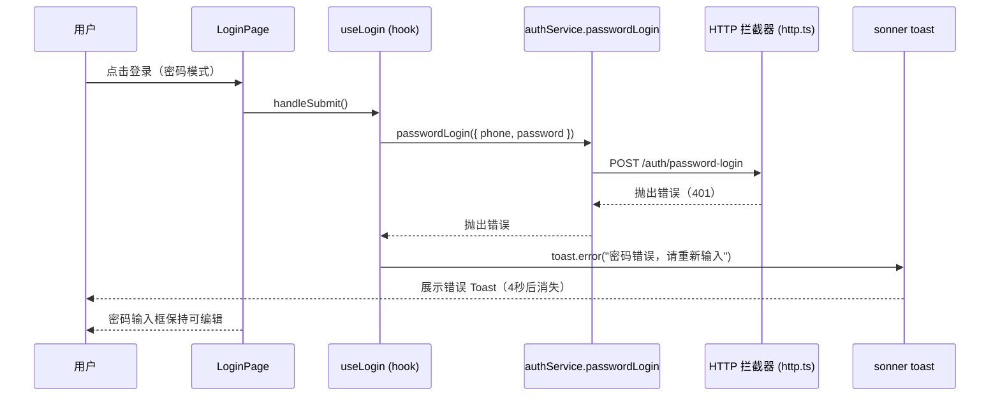

# 技术设计文档：密码错误 Toast 提示

## 概述

本功能在用户密码登录失败时，展示明确的错误 Toast 提示，替代当前 axios 拦截器的通用错误处理逻辑。

当前问题：`src/services/http.ts` 的响应拦截器对 HTTP 401 统一显示 `data?.message || '网络错误'`，无法区分"密码错误"与其他 401 场景（如 token 过期）。需要在 `useLogin` hook 的密码登录调用处捕获错误并展示专项提示。

## 架构



### 关键设计决策

**在 `useLogin` 中捕获，而非修改拦截器**

HTTP 拦截器是全局通用层，不应感知具体业务场景。密码错误的专项提示属于登录业务逻辑，应在 `useLogin.handleSubmit` 的 `catch` 块中处理。

当前 `catch` 块注释为"具体错误提示由 axios 拦截器处理"，但拦截器对 401 只做 `logout()` 不弹 toast，导致密码错误无任何提示。修复方案：在 `catch` 中判断错误类型，对密码登录的 401 展示专项 toast。

**抑制拦截器重复 toast**

拦截器对 401 不弹 toast（只调用 `logout()`），对其他错误会弹通用 toast。因此密码登录的 401 场景不会产生重复 toast，无需额外抑制逻辑。

## 组件与接口

### 修改范围

| 文件 | 修改类型 | 说明 |
|------|----------|------|
| `src/hooks/useLogin.ts` | 修改 | 在 `handleSubmit` 的 `catch` 块中添加密码错误专项处理 |
| `src/services/http.ts` | 不修改 | 拦截器保持现有逻辑，401 仅 logout 不弹 toast |

### `useLogin.handleSubmit` 修改逻辑

```typescript
// 密码登录分支的 catch 处理（伪代码）
try {
  const response = await authService.passwordLogin({ phone, password });
  // ...成功逻辑不变
} catch (error: unknown) {
  const axiosError = error as { response?: { status: number; data?: { message?: string } } };
  const status = axiosError?.response?.status;
  const message = axiosError?.response?.data?.message;

  if (status === 401) {
    // 密码错误专项提示
    toast.error('密码错误，请重新输入');
  } else if (message) {
    // 后端业务错误：展示 message 字段
    toast.error(message);
  }
  // 其他错误（500、网络超时）已由拦截器处理，此处不重复弹 toast
}
```

### Toast 配置

使用 `sonner` 的 `toast.error`，duration 设为 4000ms（4秒）：

```typescript
toast.error('密码错误，请重新输入', { duration: 4000 });
```

`sonner` 的 `toast.dismiss()` 会在新 toast 出现时自动替换同类型 toast，无需手动管理旧 toast 的关闭。

## 数据模型

本功能不涉及数据模型变更。

错误响应结构（已有，无需新增）：

```typescript
// HTTP 401 响应体（后端返回）
{
  code: 401,
  message: "密码错误" | "用户不存在" | string
}

// axios 错误对象
{
  response: {
    status: 401,
    data: { code: number, message: string }
  }
}
```

## 正确性属性

*属性（Property）是在系统所有有效执行中都应成立的特征或行为——本质上是对系统应做什么的形式化陈述。属性是人类可读规范与机器可验证正确性保证之间的桥梁。*

### 属性 1：密码错误时展示专项 toast

*对于任意* 密码登录请求，当服务器返回 HTTP 401 时，应调用 `toast.error` 且内容为"密码错误，请重新输入"，而非通用的"网络错误"。

**验证：需求 1.1、1.2、2.1**

### 属性 2：业务错误展示后端 message

*对于任意* 密码登录请求，当响应体中 `code !== 200` 且包含非空 `message` 字段时，toast 展示的内容应与后端返回的 `message` 字段完全一致。

**验证：需求 1.3**

### 属性 3：toast 展示期间输入框保持可编辑

*对于任意* 密码登录失败场景，toast 展示期间密码输入框的 `disabled` 属性应为 `false`，允许用户立即修改密码重试。

**验证：需求 1.4**

### 属性 4：非密码错误不展示密码错误提示

*对于任意* 非 401 错误（HTTP 500、网络超时等），toast 内容不应为"密码错误，请重新输入"。

**验证：需求 1.5（边界条件）**

### 属性 5：重复提交时 toast 被替换

*对于任意* 连续两次密码登录失败，第二次失败后页面上应只存在一个错误 toast，旧 toast 被替换。

**验证：需求 2.3**

## 错误处理

| 错误场景 | HTTP 状态 | 处理方 | Toast 内容 |
|----------|-----------|--------|------------|
| 密码错误 | 401 | `useLogin` catch | "密码错误，请重新输入" |
| 后端业务错误 | 200（code≠200）| 拦截器（已有） | 后端 message 字段 |
| 无权限 | 403 | 拦截器（已有） | "无权限访问" |
| 请求过频 | 429 | 拦截器（已有） | "请求过于频繁，请稍后再试" |
| 服务器错误 | 500 | 拦截器（已有） | "服务器繁忙，请稍后再试" |
| 网络超时 | 无 | 拦截器（已有） | "网络错误" |

**重复 toast 风险**：拦截器对 401 只调用 `logout()` 不弹 toast，因此密码登录 401 场景不会出现重复提示。

## 测试策略

### 单元测试（具体示例与边界条件）

- 密码登录返回 401 时，`toast.error` 被调用且参数为"密码错误，请重新输入"
- 密码登录返回 500 时，`toast.error` 不被调用（由拦截器处理）
- toast 的 `duration` 配置为 4000ms

### 属性测试（使用 `fast-check`）

每个属性测试最少运行 100 次迭代。每个测试用注释标注对应的设计属性。

**属性 1：密码错误时展示专项 toast**
```typescript
// Feature: password-error-toast, Property 1: 密码错误时展示专项 toast
it.prop([fc.string(), fc.string()])('401 时展示密码错误 toast', async (phone, password) => {
  // mock authService.passwordLogin 返回 401
  // 调用 handleSubmit
  // 断言 toast.error 被调用且内容为"密码错误，请重新输入"
});
```

**属性 2：业务错误展示后端 message**
```typescript
// Feature: password-error-toast, Property 2: 业务错误展示后端 message
it.prop([fc.string({ minLength: 1 })])('业务错误展示 message 字段', async (message) => {
  // mock 返回 code !== 200 且包含 message
  // 断言 toast.error 被调用且内容与 message 一致
});
```

**属性 3：toast 展示期间输入框保持可编辑**
```typescript
// Feature: password-error-toast, Property 3: toast 展示期间输入框保持可编辑
it.prop([fc.string()])('登录失败后输入框不被禁用', async (password) => {
  // 触发登录失败
  // 断言密码输入框 disabled 为 false
});
```

**属性 4：非密码错误不展示密码错误提示**
```typescript
// Feature: password-error-toast, Property 4: 非密码错误不展示密码错误提示
it.prop([fc.constantFrom(500, 503, 0)])('非 401 错误不展示密码错误提示', async (status) => {
  // mock 返回对应状态码
  // 断言 toast.error 未被调用，或内容不为"密码错误，请重新输入"
});
```

**属性 5：重复提交时 toast 被替换**
```typescript
// Feature: password-error-toast, Property 5: 重复提交时 toast 被替换
it.prop([fc.integer({ min: 2, max: 5 })])('连续失败后只有一个 toast', async (times) => {
  // 连续触发 times 次登录失败
  // 断言页面上只存在一个错误 toast
});
```

属性测试库：[`fast-check`](https://fast-check.io/)（项目已有 TypeScript 环境，与 vitest 集成良好）。
