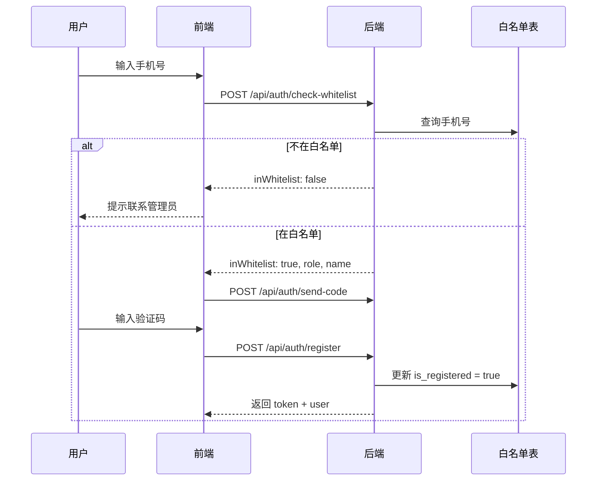

# 知识星球问答小程序 - 后端需求文档（完整版）

> **版本**: v3.0（整合版）  
> **更新日期**: 2026-02-02  
> **整合说明**: 本文档整合了 v1.0 和 v2.0 的全部内容，并补充了遗漏的需求

---

## 📋 版本更新记录

### v3.1 (2026-02-02) - 埋点/行为分析版
- ✅ **新增**: 行为日志上报 API (`POST /api/behavior/log`)
- ✅ **新增**: 行为日志表 (`behavior_logs`)
- ✅ **新增**: 埋点事件规范（与前端对齐）
- ✅ **更新**: 确定技术栈为 Node.js + Express + Prisma

### v3.0 (2026-02-02) - 整合版
- ✅ 整合 v1.0 + v2.0 全部内容
- ✅ **新增**: 消息通知系统 API
- ✅ **新增**: 学生年级/年龄字段
- ✅ **新增**: 实时更新机制（WebSocket）
- ✅ **新增**: 搜索功能 API
- ✅ **新增**: 版本迁移指南

### v2.1 (2026-02-01)
- 新增课时管理系统
- 新增学生注册年级和年龄字段
- 新增课时过期后权限降级逻辑

### v2.0 (2026-02-01)
- 新增用户白名单管理系统
- 新增管理后台页面
- 明确教师即管理员身份

### v1.0 (2026-01-31)
- 初始版本，核心功能定义

---

## 一、系统概述

### 1.1 应用架构（已确定）
| 层级 | 技术选型 | 说明 |
|-----|---------|------|
| **前端** | React 18 + TypeScript + Vite | Zustand + TanStack Query |
| **后端** | Node.js 18+ + Express.js | RESTful API |
| **语言** | TypeScript | 前后端统一 |
| **ORM** | Prisma | 类型安全的现代化 ORM |
| **数据库** | PostgreSQL 14+ | 主数据库 |
| **缓存** | Redis 7+ | 会话、热点缓存 |
| **存储** | OSS 对象存储 | 图片、音频文件 |
| **AI服务** | 阿里云/腾讯云内容审核 | 文本、图片审核 |
| **验证** | Zod | 请求参数验证 |

### 1.2 用户角色权限矩阵

| 功能 | 学生(有效期内) | 学生(已过期) | 家长 | 教师/管理员 |
|-----|--------------|-------------|------|------------|
| 浏览问题 | ✅ | ✅ | ✅ | ✅ |
| 点赞问题 | ✅ | ✅ | ✅ | ✅ |
| 收藏问题 | ✅ | ✅ | ✅ | ✅ |
| 提问 | ✅ | ❌ | ❌ | ✅ |
| 回答 | ❌ | ❌ | ❌ | ✅ |
| 评论(自己的问题) | ✅ | ❌ | ❌ | ✅ |
| 评论(所有问题) | ❌ | ❌ | ❌ | ✅ |
| 录制音频 | ❌ | ❌ | ❌ | ✅ |
| 审核内容 | ❌ | ❌ | ❌ | ✅ |
| 置顶/好问题 | ❌ | ❌ | ❌ | ✅ |
| 管理白名单 | ❌ | ❌ | ❌ | ✅ |

> **重要说明**:
> - 教师即管理员，拥有系统最高权限
> - 学生课时过期后，权限自动降级为家长模式
> - 家长权限不受课时过期影响

### 1.3 注册控制机制

本系统采用 **白名单注册制度**：
- ✅ 只有管理员添加到白名单的手机号才能注册
- ✅ 白名单记录包括：手机号、姓名、预设角色、课时有效期
- ✅ 未在白名单的手机号将无法完成注册
- ❌ 邀请码系统已废弃

---

## 二、数据库设计

### 2.1 用户相关表

#### **用户表 (users)**
```sql
CREATE TABLE users (
  id              VARCHAR(36) PRIMARY KEY,
  phone           VARCHAR(11) UNIQUE NOT NULL,
  nickname        VARCHAR(50) NOT NULL,
  avatar          VARCHAR(500),
  role            ENUM('student', 'parent', 'teacher') NOT NULL,
  grade           VARCHAR(20),           -- ⭐新增: 年级（如"初一"、"初二"）
  birth_year      INT,                   -- ⭐新增: 出生年份
  school          VARCHAR(100),          -- ⭐新增: 学校名称
  created_at      TIMESTAMP DEFAULT NOW(),
  updated_at      TIMESTAMP DEFAULT NOW(),
  is_active       BOOLEAN DEFAULT TRUE,
  is_banned       BOOLEAN DEFAULT FALSE,
  
  INDEX idx_phone (phone),
  INDEX idx_role (role)
);
```

#### **用户白名单表 (user_whitelist)**
```sql
CREATE TABLE user_whitelist (
  id              VARCHAR(36) PRIMARY KEY,
  phone           VARCHAR(11) UNIQUE NOT NULL,
  name            VARCHAR(50) NOT NULL,        -- 真实姓名
  role            ENUM('student', 'parent', 'teacher') NOT NULL,
  grade           VARCHAR(20),                 -- ⭐新增: 预设年级
  is_registered   BOOLEAN DEFAULT FALSE,
  user_id         VARCHAR(36) NULL,            -- FK users.id
  created_by      VARCHAR(36) NOT NULL,        -- FK users.id
  created_at      TIMESTAMP DEFAULT NOW(),
  registered_at   TIMESTAMP,
  valid_until     TIMESTAMP,                   -- 课时有效期
  notes           TEXT,
  
  INDEX idx_phone (phone),
  INDEX idx_role (role),
  INDEX idx_is_registered (is_registered),
  FOREIGN KEY (user_id) REFERENCES users(id),
  FOREIGN KEY (created_by) REFERENCES users(id)
);
```

#### **家长学生绑定表 (parent_child_binding)**
```sql
CREATE TABLE parent_child_binding (
  id              VARCHAR(36) PRIMARY KEY,
  parent_id       VARCHAR(36) NOT NULL,
  child_id        VARCHAR(36) NOT NULL,
  created_at      TIMESTAMP DEFAULT NOW(),
  
  UNIQUE KEY uk_binding (parent_id, child_id),
  FOREIGN KEY (parent_id) REFERENCES users(id),
  FOREIGN KEY (child_id) REFERENCES users(id)
);
```

### 2.2 问题相关表

#### **问题表 (questions)**
```sql
CREATE TABLE questions (
  id               VARCHAR(36) PRIMARY KEY,
  title            VARCHAR(100) NOT NULL,
  content          TEXT,
  author_id        VARCHAR(36) NOT NULL,       -- FK users.id
  status           ENUM('pending', 'approved', 'rejected', 'banned') DEFAULT 'pending',
  ai_result        TEXT,                       -- AI审核结果
  score            INT CHECK(score >= 1 AND score <= 5),
  is_good_question BOOLEAN DEFAULT FALSE,
  is_pinned        BOOLEAN DEFAULT FALSE,
  pinned_at        TIMESTAMP,
  reject_reason    TEXT,
  difficulty       ENUM('easy', 'medium', 'hard'),
  likes_count      INT DEFAULT 0,
  favorites_count  INT DEFAULT 0,
  comments_count   INT DEFAULT 0,
  answers_count    INT DEFAULT 0,
  created_at       TIMESTAMP DEFAULT NOW(),
  updated_at       TIMESTAMP DEFAULT NOW(),
  deleted_at       TIMESTAMP,                  -- 软删除
  
  INDEX idx_author (author_id),
  INDEX idx_status (status),
  INDEX idx_created (created_at),
  INDEX idx_pinned (is_pinned, pinned_at),
  FOREIGN KEY (author_id) REFERENCES users(id)
);
```

#### **问题图片表 (question_images)**
```sql
CREATE TABLE question_images (
  id           VARCHAR(36) PRIMARY KEY,
  question_id  VARCHAR(36) NOT NULL,
  image_url    VARCHAR(500) NOT NULL,
  sort_order   INT DEFAULT 0,
  created_at   TIMESTAMP DEFAULT NOW(),
  
  FOREIGN KEY (question_id) REFERENCES questions(id) ON DELETE CASCADE
);
```

#### **问题音频表 (question_audios)**
```sql
CREATE TABLE question_audios (
  id           VARCHAR(36) PRIMARY KEY,
  question_id  VARCHAR(36) NOT NULL,
  audio_url    VARCHAR(500) NOT NULL,
  duration     INT,                           -- 秒
  file_size    INT,                           -- 字节
  created_at   TIMESTAMP DEFAULT NOW(),
  
  FOREIGN KEY (question_id) REFERENCES questions(id) ON DELETE CASCADE
);
```

#### **问题标签表 (question_tags)**
```sql
CREATE TABLE question_tags (
  id           VARCHAR(36) PRIMARY KEY,
  question_id  VARCHAR(36) NOT NULL,
  tag_name     VARCHAR(50) NOT NULL,
  created_at   TIMESTAMP DEFAULT NOW(),
  
  INDEX idx_tag (tag_name),
  FOREIGN KEY (question_id) REFERENCES questions(id) ON DELETE CASCADE
);
```

### 2.3 回答相关表

#### **回答表 (answers)**
```sql
CREATE TABLE answers (
  id           VARCHAR(36) PRIMARY KEY,
  question_id  VARCHAR(36) NOT NULL,
  content      TEXT NOT NULL,
  author_id    VARCHAR(36) NOT NULL,
  status       ENUM('pending', 'approved', 'rejected', 'banned') DEFAULT 'pending',
  ai_result    TEXT,
  likes_count  INT DEFAULT 0,
  created_at   TIMESTAMP DEFAULT NOW(),
  updated_at   TIMESTAMP DEFAULT NOW(),
  deleted_at   TIMESTAMP,
  
  INDEX idx_question (question_id),
  INDEX idx_author (author_id),
  FOREIGN KEY (question_id) REFERENCES questions(id),
  FOREIGN KEY (author_id) REFERENCES users(id)
);
```

#### **回答图片表 (answer_images)**
```sql
CREATE TABLE answer_images (
  id          VARCHAR(36) PRIMARY KEY,
  answer_id   VARCHAR(36) NOT NULL,
  image_url   VARCHAR(500) NOT NULL,
  sort_order  INT DEFAULT 0,
  created_at  TIMESTAMP DEFAULT NOW(),
  
  FOREIGN KEY (answer_id) REFERENCES answers(id) ON DELETE CASCADE
);
```

#### **回答音频表 (answer_audios)**
```sql
CREATE TABLE answer_audios (
  id          VARCHAR(36) PRIMARY KEY,
  answer_id   VARCHAR(36) NOT NULL,
  audio_url   VARCHAR(500) NOT NULL,
  duration    INT,
  file_size   INT,
  created_at  TIMESTAMP DEFAULT NOW(),
  
  FOREIGN KEY (answer_id) REFERENCES answers(id) ON DELETE CASCADE
);
```

### 2.4 评论表

```sql
CREATE TABLE comments (
  id           VARCHAR(36) PRIMARY KEY,
  question_id  VARCHAR(36) NOT NULL,
  content      TEXT NOT NULL,
  image_url    VARCHAR(500),
  author_id    VARCHAR(36) NOT NULL,
  status       ENUM('pending', 'approved', 'rejected', 'banned') DEFAULT 'pending',
  ai_result    TEXT,
  created_at   TIMESTAMP DEFAULT NOW(),
  updated_at   TIMESTAMP DEFAULT NOW(),
  deleted_at   TIMESTAMP,
  
  INDEX idx_question (question_id),
  FOREIGN KEY (question_id) REFERENCES questions(id),
  FOREIGN KEY (author_id) REFERENCES users(id)
);
```

### 2.5 互动相关表

#### **点赞表 (likes)**
```sql
CREATE TABLE likes (
  id           VARCHAR(36) PRIMARY KEY,
  user_id      VARCHAR(36) NOT NULL,
  target_type  ENUM('question', 'answer') NOT NULL,
  target_id    VARCHAR(36) NOT NULL,
  created_at   TIMESTAMP DEFAULT NOW(),
  
  UNIQUE KEY uk_like (user_id, target_type, target_id),
  FOREIGN KEY (user_id) REFERENCES users(id)
);
```

#### **收藏表 (favorites)**
```sql
CREATE TABLE favorites (
  id           VARCHAR(36) PRIMARY KEY,
  user_id      VARCHAR(36) NOT NULL,
  question_id  VARCHAR(36) NOT NULL,
  created_at   TIMESTAMP DEFAULT NOW(),
  
  UNIQUE KEY uk_favorite (user_id, question_id),
  FOREIGN KEY (user_id) REFERENCES users(id),
  FOREIGN KEY (question_id) REFERENCES questions(id)
);
```

### 2.6 日志相关表

#### **审核日志表 (audit_logs)**
```sql
CREATE TABLE audit_logs (
  id           VARCHAR(36) PRIMARY KEY,
  auditor_id   VARCHAR(36) NOT NULL,
  target_type  ENUM('question', 'answer', 'comment') NOT NULL,
  target_id    VARCHAR(36) NOT NULL,
  action       ENUM('approve', 'reject', 'ban') NOT NULL,
  reason       TEXT,
  created_at   TIMESTAMP DEFAULT NOW(),
  
  INDEX idx_auditor (auditor_id),
  INDEX idx_target (target_type, target_id),
  FOREIGN KEY (auditor_id) REFERENCES users(id)
);
```

#### **白名单操作日志表 (whitelist_logs)**
```sql
CREATE TABLE whitelist_logs (
  id            VARCHAR(36) PRIMARY KEY,
  operator_id   VARCHAR(36) NOT NULL,
  whitelist_id  VARCHAR(36) NOT NULL,
  action        ENUM('add', 'remove', 'update') NOT NULL,
  reason        TEXT,
  created_at    TIMESTAMP DEFAULT NOW(),
  
  FOREIGN KEY (operator_id) REFERENCES users(id)
);
```

### 2.7 通知相关表 ⭐新增

#### **通知表 (notifications)**
```sql
CREATE TABLE notifications (
  id           VARCHAR(36) PRIMARY KEY,
  user_id      VARCHAR(36) NOT NULL,          -- 接收者
  type         ENUM('answer', 'comment', 'audit_result', 'system') NOT NULL,
  title        VARCHAR(100) NOT NULL,
  content      TEXT,
  target_type  VARCHAR(50),                   -- 关联实体类型
  target_id    VARCHAR(36),                   -- 关联实体ID
  is_read      BOOLEAN DEFAULT FALSE,
  created_at   TIMESTAMP DEFAULT NOW(),
  
  INDEX idx_user (user_id),
  INDEX idx_read (is_read),
  FOREIGN KEY (user_id) REFERENCES users(id)
);
```

### 2.8 行为日志表 ⭐新增 (埋点分析)

#### **行为日志表 (behavior_logs)**
```sql
CREATE TABLE behavior_logs (
  id           VARCHAR(36) PRIMARY KEY,
  user_id      VARCHAR(36),              -- 可为空（未登录用户）
  session_id   VARCHAR(100),             -- 会话标识
  event_type   VARCHAR(100) NOT NULL,    -- 事件类型，如 'page_view', 'question_like'
  metadata     JSON,                     -- 自定义属性
  path         VARCHAR(500),             -- 页面路径
  referrer     VARCHAR(500),             -- 来源页面
  user_agent   VARCHAR(500),             -- 客户端信息
  ip_address   VARCHAR(50),              -- IP地址（脱敏存储）
  created_at   TIMESTAMP DEFAULT NOW(),
  
  INDEX idx_user (user_id),
  INDEX idx_event_type (event_type),
  INDEX idx_created (created_at),
  FOREIGN KEY (user_id) REFERENCES users(id)
);
```

> **隐私说明**: 
> - IP 地址仅保留前三段，脱敏处理
> - 禁止存储手机号等 PII 信息
> - 定期清理超过 90 天的日志

---

## 三、API接口设计

### 3.1 认证相关 (Auth)

#### **1. 发送验证码**
```
POST /api/auth/send-code
请求体: { phone: string }
响应: { success: boolean, message: string }
限制: 60秒内不可重复发送
```

#### **2. 验证手机号是否在白名单**
```
POST /api/auth/check-whitelist
请求体: { phone: string }
响应: { 
  inWhitelist: boolean, 
  role?: string,
  name?: string,
  validUntil?: string,
  message: string 
}
```

#### **3. 登录**
```
POST /api/auth/login
请求体: { phone: string, code: string }
响应: { 
  token: string, 
  user: { id, nickname, avatar, role, phone, grade, school, validUntil },
  permissions: { canAsk: boolean, canComment: boolean, ... }
}
```

#### **4. 注册**
```
POST /api/auth/register
请求体: { 
  phone: string, 
  code: string, 
  nickname?: string,
  grade?: string,        -- ⭐新增
  birthYear?: number,    -- ⭐新增
  school?: string        -- ⭐新增: 学校名称
}
响应: { 
  token: string, 
  user: { id, nickname, avatar, role, phone, grade, school } 
}
```

#### **5. 退出登录**
```
POST /api/auth/logout
请求头: Authorization: Bearer {token}
响应: { success: boolean }
```

---

### 3.2 用户相关 (User)

#### **6. 获取当前用户信息**
```
GET /api/user/profile
请求头: Authorization: Bearer {token}
响应: { 
  id, nickname, avatar, role, phone, grade, school, birthYear,
  validUntil,           -- 课时有效期
  isExpired,            -- 是否已过期
  stats: {
    questionsCount, answersCount, likesCount, favoritesCount
  },
  permissions: {
    canAsk, canAnswer, canComment, canAudit, canManageUsers
  }
}
```

#### **7. 更新用户信息**
```
PUT /api/user/profile
请求头: Authorization: Bearer {token}
请求体: { nickname?: string, avatar?: string, grade?: string }
响应: { success: boolean, user: {...} }
```

#### **8. 上传头像**
```
POST /api/user/avatar
请求头: Authorization: Bearer {token}
请求体: FormData { file: File }
响应: { avatarUrl: string }
限制: 图片最大5MB，支持jpg/png/gif
```

---

### 3.3 白名单管理 (Whitelist) - 管理员专属

#### **38. 获取白名单列表**
```
GET /api/admin/whitelist?page=1&limit=20&search=&role=all&status=all
请求头: Authorization: Bearer {token}
查询参数:
  - page: 页码
  - limit: 每页数量
  - search: 搜索关键词（手机号或姓名）
  - role: 角色筛选（all | student | teacher | parent）
  - status: 状态筛选（all | registered | pending | expired）
响应: {
  users: [...],
  stats: { total, registered, pending, expired, students, teachers, parents },
  total, page, totalPages
}
权限: 教师/管理员
```

#### **39. 添加用户到白名单**
```
POST /api/admin/whitelist
请求头: Authorization: Bearer {token}
请求体: {
  phone: string,
  name: string,
  role: 'student' | 'teacher' | 'parent',
  grade?: string,
  validUntil?: string,   -- ISO日期格式
  notes?: string
}
响应: { success: boolean, user: {...} }
权限: 教师/管理员
```

#### **40. 从白名单移除用户**
```
DELETE /api/admin/whitelist/:id
请求头: Authorization: Bearer {token}
响应: { success: boolean, message: string }
权限: 教师/管理员
```

#### **41. 更新白名单用户课时**
```
PATCH /api/admin/whitelist/:id/validity
请求头: Authorization: Bearer {token}
请求体: { validUntil: string }
响应: { success: boolean }
权限: 教师/管理员
```

#### **42. 批量导入白名单**
```
POST /api/admin/whitelist/batch-import
请求头: Authorization: Bearer {token}
请求体: FormData { file: File }  // Excel/CSV文件
响应: { 
  success: boolean,
  imported: number,
  failed: number,
  errors: [ { row, phone, reason } ]
}
权限: 教师/管理员
```

#### **43. 导出白名单**
```
GET /api/admin/whitelist/export?format=csv
请求头: Authorization: Bearer {token}
响应: 文件下载
权限: 教师/管理员
```

#### **44. 获取白名单统计信息**
```
GET /api/admin/whitelist/stats
请求头: Authorization: Bearer {token}
响应: {
  total: number,
  registered: number,
  pending: number,
  expired: number,
  byRole: { student, teacher, parent },
  recentRegistrations: number
}
权限: 教师/管理员
```

---

### 3.4 问题相关 (Question)

#### **9. 获取问题列表**
```
GET /api/questions?page=1&limit=20&sort=latest&filter=all&tag=&search=
请求头: Authorization: Bearer {token}
查询参数:
  - page, limit: 分页
  - sort: latest | hot | pinned
  - filter: all | good | my
  - tag: 标签筛选
  - search: 关键词搜索 ⭐新增
  - difficulty: easy | medium | hard
响应: {
  questions: [...],
  total, page, totalPages
}
```

#### **10. 搜索问题** ⭐新增
```
GET /api/questions/search?q=关键词&page=1&limit=20
请求头: Authorization: Bearer {token}
响应: {
  questions: [...],
  total, highlights: [...]
}
```

#### **11. 获取问题详情**
```
GET /api/questions/:id
请求头: Authorization: Bearer {token}
响应: {
  question: { ...完整问题信息 },
  answers: [ ...回答列表 ],
  comments: [ ...评论列表 ],
  userActions: { liked, favorited }
}
```

#### **12. 创建问题**
```
POST /api/questions
请求头: Authorization: Bearer {token}
请求体: {
  title: string (必填, max 100),
  content?: string (max 500),
  images?: string[] (max 3),
  audioUrl?: string,
  tags?: string[],
  difficulty?: 'easy' | 'medium' | 'hard'
}
响应: { success: boolean, question: { id, status, ... } }
权限: 学生(有效期内)、教师
```

#### **13. 上传问题图片**
```
POST /api/questions/upload-image
请求头: Authorization: Bearer {token}
请求体: FormData { file: File }
响应: { imageUrl: string }
权限: 学生(有效期内)、教师
```

#### **14. 上传问题音频**
```
POST /api/questions/upload-audio
请求头: Authorization: Bearer {token}
请求体: FormData { file: File }
响应: { audioUrl: string, duration: number }
权限: 仅教师
```

#### **15. 置顶/取消置顶问题**
```
PATCH /api/questions/:id/pin
请求头: Authorization: Bearer {token}
请求体: { isPinned: boolean }
响应: { success: boolean }
权限: 教师
```

#### **16. 删除问题（软删除）**
```
DELETE /api/questions/:id
请求头: Authorization: Bearer {token}
响应: { success: boolean }
权限: 问题作者或管理员
```

---

### 3.5 回答相关 (Answer)

#### **17. 创建回答**
```
POST /api/answers
请求头: Authorization: Bearer {token}
请求体: {
  questionId: string,
  content: string (max 2000),
  images?: string[] (max 5),
  audioUrl?: string
}
响应: { success: boolean, answer: { id, status, ... } }
权限: 仅教师
```

#### **18. 上传回答图片**
```
POST /api/answers/upload-image
请求头: Authorization: Bearer {token}
请求体: FormData { file: File }
响应: { imageUrl: string }
权限: 教师
```

#### **19. 上传回答音频**
```
POST /api/answers/upload-audio
请求头: Authorization: Bearer {token}
请求体: FormData { file: File }
响应: { audioUrl: string, duration: number }
权限: 教师
```

#### **20. 删除回答（软删除）**
```
DELETE /api/answers/:id
请求头: Authorization: Bearer {token}
响应: { success: boolean }
权限: 回答作者或管理员
```

---

### 3.6 评论相关 (Comment)

#### **21. 获取评论列表**
```
GET /api/comments?questionId={id}&page=1&limit=50
请求头: Authorization: Bearer {token}
响应: { comments: [...], total }
```

#### **22. 创建评论**
```
POST /api/comments
请求头: Authorization: Bearer {token}
请求体: {
  questionId: string,
  content: string,
  image?: string
}
响应: { success: boolean, comment: { id, status, ... } }
权限: 提问者(自己的问题)、教师(所有问题)
```

#### **23. 上传评论图片**
```
POST /api/comments/upload-image
请求头: Authorization: Bearer {token}
请求体: FormData { file: File }
响应: { imageUrl: string }
```

#### **24. 删除评论（软删除）**
```
DELETE /api/comments/:id
请求头: Authorization: Bearer {token}
响应: { success: boolean }
权限: 评论作者或管理员
```

---

### 3.7 互动相关 (Interaction)

#### **25. 点赞/取消点赞**
```
POST /api/interactions/like
请求头: Authorization: Bearer {token}
请求体: {
  targetType: 'question' | 'answer',
  targetId: string,
  action: 'like' | 'unlike'
}
响应: { success: boolean, liked: boolean, likesCount: number }
权限: 所有用户
```

#### **26. 收藏/取消收藏**
```
POST /api/interactions/favorite
请求头: Authorization: Bearer {token}
请求体: {
  questionId: string,
  action: 'favorite' | 'unfavorite'
}
响应: { success: boolean, favorited: boolean, favoritesCount: number }
权限: 所有用户
```

#### **27. 获取我的点赞列表**
```
GET /api/interactions/my-likes?page=1&limit=20
请求头: Authorization: Bearer {token}
响应: { likes: [...], total }
```

#### **28. 获取我的收藏列表**
```
GET /api/interactions/my-favorites?page=1&limit=20
请求头: Authorization: Bearer {token}
响应: { favorites: [...], total }
```

---

### 3.8 审核相关 (Audit)

#### **29. 获取待审核内容列表**
```
GET /api/audit/pending?type=question&page=1&limit=20
请求头: Authorization: Bearer {token}
查询参数:
  - type: question | answer | comment
  - status: pending | approved | rejected | banned
响应: {
  items: [...],
  counts: { pending, approved, rejected, banned },
  total
}
权限: 教师
```

#### **30. 审核通过**
```
POST /api/audit/approve
请求头: Authorization: Bearer {token}
请求体: { type: 'question'|'answer'|'comment', id: string }
响应: { success: boolean }
权限: 教师
```

#### **31. 审核驳回**
```
POST /api/audit/reject
请求头: Authorization: Bearer {token}
请求体: { type: string, id: string, reason: string }
响应: { success: boolean }
权限: 教师
```

#### **32. 封禁内容**
```
POST /api/audit/ban
请求头: Authorization: Bearer {token}
请求体: { type: string, id: string, reason: string }
响应: { success: boolean }
权限: 教师
```

#### **33. 标记好问题**
```
POST /api/audit/mark-good-question
请求头: Authorization: Bearer {token}
请求体: { questionId: string, isGoodQuestion: boolean }
响应: { success: boolean }
权限: 教师
```

#### **34. 问题评分**
```
POST /api/audit/score-question
请求头: Authorization: Bearer {token}
请求体: { questionId: string, score: number (1-5) }
响应: { success: boolean }
权限: 教师
```

#### **35. 获取审核统计**
```
GET /api/audit/stats
请求头: Authorization: Bearer {token}
响应: {
  questions: { pending, approved, rejected, banned },
  answers: { pending, approved, rejected, banned },
  comments: { pending, approved, rejected, banned }
}
权限: 教师
```

---

### 3.9 个人中心相关 (Profile)

#### **36. 获取我的提问列表**
```
GET /api/profile/my-questions?page=1&limit=20&status=all
请求头: Authorization: Bearer {token}
响应: { questions: [...], total }
```

#### **37. 获取我的回答列表**
```
GET /api/profile/my-answers?page=1&limit=20
请求头: Authorization: Bearer {token}
响应: { answers: [...], total }
权限: 教师
```

---

### 3.10 通知相关 (Notification) ⭐新增

#### **45. 获取通知列表**
```
GET /api/notifications?page=1&limit=20&unread=false
请求头: Authorization: Bearer {token}
响应: {
  notifications: [...],
  unreadCount: number,
  total
}
```

#### **46. 标记通知已读**
```
POST /api/notifications/read
请求头: Authorization: Bearer {token}
请求体: { ids: string[] }  // 空数组表示全部标记已读
响应: { success: boolean }
```

#### **47. 获取未读通知数量**
```
GET /api/notifications/unread-count
请求头: Authorization: Bearer {token}
响应: { count: number }
```

---

### 3.11 行为日志相关 (Behavior/Tracking) ⭐新增

#### **48. 上报行为日志**
```
POST /api/behavior/log
请求头: Authorization: Bearer {token} (可选)
请求体: {
  type: string,           -- 事件类型，如 'page_view', 'good_question_click'
  timestamp: number,      -- 客户端时间戳 (ms)
  metadata: {             -- 自定义属性
    questionId?: string,
    source?: string,
    path?: string,
    referrer?: string,
    ... 
  }
}
响应: { code: 200, message: 'success', data: { logId: string } }
权限: 所有用户（包括未登录）
幂等性: 否
```

#### **49. 批量上报行为日志**
```
POST /api/behavior/batch-log
请求头: Authorization: Bearer {token} (可选)
请求体: {
  events: [
    { type, timestamp, metadata },
    ...
  ]
}
响应: { code: 200, message: 'success', data: { count: number } }
权限: 所有用户
说明: 用于离线缓存的批量上报，最多 50 条/次
```

#### **事件类型规范 (与前端对齐)**

| 事件ID | 名称 | 触发时机 | 自定义属性 |
|-------|------|---------|------------|
| `page_view` | 页面访问 | 路由切换完成 | `path`, `referrer` |
| `good_question_click` | 好问题点击 | 点击好问题徽章 | `questionId`, `source` |
| `question_like` | 问题点赞 | 点赞/取消点赞 | `questionId`, `isLike` |
| `question_favorite` | 问题收藏 | 收藏/取消收藏 | `questionId`, `isFavorite` |
| `question_create_submit` | 提交问题 | 表单提交成功 | `questionId`, `subject` |
| `audio_play` | 音频播放 | 开始播放音频 | `questionId`, `duration` |
| `search` | 搜索 | 执行搜索 | `query`, `resultCount` |

---

## 四、核心业务逻辑

### 4.1 白名单注册流程



### 4.2 课时过期权限降级

```javascript
// 后端中间件伪代码
async function checkPermissions(req, user) {
  // 教师不受课时限制
  if (user.role === 'teacher') return fullPermissions;
  
  // 家长始终是只读权限
  if (user.role === 'parent') return readOnlyPermissions;
  
  // 检查学生课时是否过期
  const whitelist = await db.userWhitelist.findOne({ userId: user.id });
  const isExpired = whitelist?.validUntil && new Date() > whitelist.validUntil;
  
  if (isExpired) {
    // 降级为家长权限
    return readOnlyPermissions;
  }
  
  return studentPermissions;
}
```

### 4.3 审核流程

```
用户提交内容 → AI初筛 → 状态='pending' → 教师审核 → 通过/驳回/封禁
```

- AI审核结果存储到 `ai_result` 字段
- 仅 `status='approved'` 的内容对外可见
- 审核操作记录到 `audit_logs`

### 4.4 置顶排序逻辑

```sql
ORDER BY 
  is_pinned DESC,        -- 置顶优先
  pinned_at DESC,        -- 置顶时间倒序
  created_at DESC        -- 创建时间倒序
```

---

## 五、安全性要求

### 5.1 认证与授权
- ✅ JWT Token 认证（7天过期）
- ✅ 角色权限验证中间件
- ✅ 白名单验证机制
- ⚠️ 刷新Token机制
- ⚠️ IP限流（防接口滥用）

### 5.2 数据验证
- ✅ 手机号格式验证（11位数字）
- ✅ 白名单存在性验证
- ✅ 字段长度限制
- ✅ 文件类型验证（图片: jpg/png/gif, 音频: mp3/wav/m4a）
- ✅ 文件大小限制（图片5MB, 音频10MB）
- ⚠️ SQL注入防护
- ⚠️ XSS防护

### 5.3 内容安全
- ✅ AI内容审核
- ✅ 敏感词过滤
- ✅ 图片鉴黄
- ⚠️ 用户举报机制

---

## 六、错误码规范

| 错误码 | 说明 |
|-------|------|
| 200 | 成功 |
| 400 | 参数错误 |
| 401 | 未登录 |
| 403 | 无权限 |
| 404 | 资源不存在 |
| 429 | 请求过于频繁 |
| 500 | 服务器错误 |
| 1001 | 手机号格式错误 |
| 1002 | 验证码错误 |
| 2001 | 文件类型不支持 |
| 2002 | 文件过大 |
| 3001 | 无提问权限 |
| 3002 | 无回答权限 |
| 3003 | 无评论权限 |
| 3004 | 无审核权限 |
| 3005 | 无白名单管理权限 |
| 4001 | 手机号未在白名单中 |
| 4002 | 手机号已注册 |
| 4003 | 账号已被停用 |
| 4004 | 课时已过期 |

---

## 七、开发优先级

### Phase 1 - MVP核心
1. ✅ 白名单系统
2. ✅ 用户登录/注册
3. ✅ 问题CRUD
4. ✅ 回答CRUD
5. ✅ 评论CRUD
6. ✅ 点赞/收藏
7. ✅ 文件上传

### Phase 2 - 审核系统
1. ✅ AI内容审核接入
2. ✅ 教师审核管理
3. ✅ 好问题/置顶

### Phase 3 - 扩展功能
1. ⚠️ 搜索功能
2. ⚠️ 消息通知
3. ⚠️ 批量导入白名单

### Phase 4 - 性能优化
1. ⚠️ Redis缓存
2. ⚠️ CDN加速
3. ⚠️ 接口限流

---

## 八、后端技术栈（已确定）

| 层级 | 技术选型 | 说明 |
|-----|---------|------|
| **运行时** | Node.js 18+ | ES Modules |
| **框架** | Express.js | 轻量灵活 |
| **语言** | TypeScript | 类型安全 |
| **ORM** | Prisma | 现代化 ORM |
| **数据库** | PostgreSQL 14+ | 主数据库 |
| **缓存** | Redis 7+ | 热点数据 |
| **验证** | Zod | 运行时类型验证 |
| **日志** | Pino | 结构化日志 |
| **测试** | Jest | 单元测试 |

---

**文档版本**: v3.1（埋点/行为分析版）  
**最后更新**: 2026-02-02  
**图例**: ✅=前端已完成 ⚠️=需后端实现 ⭐=新增内容
