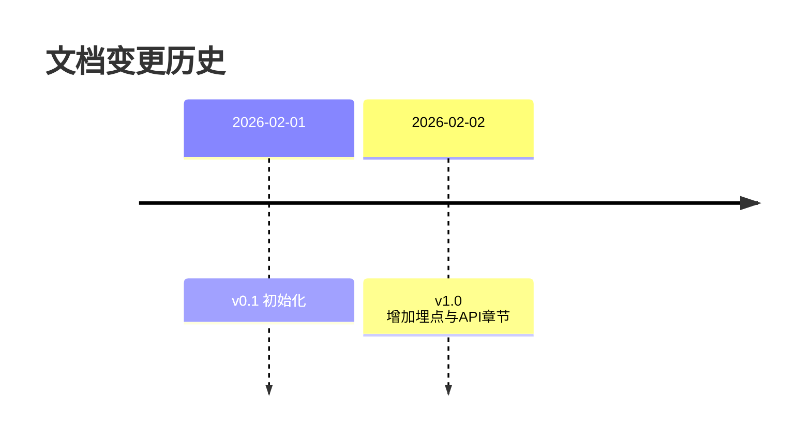

# 知识星球问答小程序 - 前端需求规格说明书 v1.0

> **文档状态**: 草稿
> **版本**: v1.0
> **最后更新**: 2026-02-02

---

## 目录
1. [引言](#1-引言)
2. [埋点需求 (Tracking)](#2-埋点需求-tracking)
3. [API 接口规范](#3-api-接口规范)
4. [附录](#4-附录)

---

## 1. 引言
本文档旨在规范前端开发中的数据埋点与前后端接口交互标准，确保数据采集的准确性与系统集成的稳定性。

---

## 2. 埋点需求 (Tracking)

### 2.1 事件命名规范
采用 `Object_Action_Phase` 格式，全小写，下划线分隔。
- **Object**: 操作对象 (e.g., `question`, `button`, `page`)
- **Action**: 动作 (e.g., `click`, `view`, `submit`)
- **Phase**: 阶段 (可选, e.g., `success`, `fail`)

**示例**:
- `good_question_badge_click`
- `question_create_submit_success`
- `home_page_view`

### 2.2 核心埋点事件表

| 事件ID | 事件名称 | 触发时机 | 自定义属性 (Metadata) | 采样率 |
|---|---|---|---|---|
| `page_view` | 页面访问 | 路由切换完成时 | `path`, `referrer` | 100% |
| `good_question_click` | 好问题点击 | 点击“好问题”徽章 | `questionId`, `sourcePage` | 100% |
| `question_like` | 问题点赞 | 点击点赞按钮 | `questionId`, `isLike` (bool) | 100% |
| `diagnostic_run` | 诊断运行 | 点击开始诊断 | `mode` | 10% |

### 2.3 技术要求
1.  **上报策略**:
    - 实时上报: 关键交互 (Click)
    - 批量上报: 曝光类 (View)，每 10 条或 30秒 上报一次
2.  **失败重试**:
    - 网络异常时，存入 `localStorage`
    - 网络恢复或下次启动时重试，最大重试 3 次
3.  **隐私合规**:
    - 禁止上报 PII (个人敏感信息) 如手机号明文
    - 用户 ID 需脱敏或使用 Hash

### 2.4 字段映射表 (与神策/Google Analytics)
| 内部字段 | Sensors Analytics | Google Analytics 4 |
|---|---|---|
| `type` | `event` | `event_name` |
| `metadata.questionId` | `question_id` | `item_id` |
| `timestamp` | `time` | `timestamp_micros` |

---

## 3. API 接口规范

### 3.1 基础规范
- **Base URL**: `/api/v1`
- **Protocol**: HTTPS
- **Data Format**: JSON
- **Date Format**: ISO 8601 (`YYYY-MM-DDTHH:mm:ssZ`)

### 3.2 通用 Headers
```http
Content-Type: application/json
Authorization: Bearer <token>
X-Client-Version: 1.0.0
X-Request-ID: <uuid>
```

### 3.3 接口定义详情

#### 3.3.1 行为日志上报
- **URL**: `/behavior/log`
- **Method**: `POST`
- **描述**: 上报用户行为埋点
- **幂等性**: 否 (每次点击都是新事件)

**Request Example**:
```json
{
  "type": "good_question_click",
  "timestamp": 1706832000000,
  "metadata": {
    "questionId": "q123",
    "source": "home"
  }
}
```

**Response Example**:
```json
{
  "code": 200,
  "message": "success",
  "data": { "logId": "l_999" }
}
```

#### 3.3.2 获取问题列表
- **URL**: `/questions`
- **Method**: `GET`
- **Params**: `page`, `limit`, `subject`

#### 3.3.3 认证注册与登录
- **注册 URL**: `/auth/register`
- **Method**: `POST`
- **Request**:
```json
{
  "phone": "13800138000",
  "code": "123456",
  "nickname": "新学生",
  "grade": "初一",
  "age": 15,
  "school": "测试中学"
}
```
- **Response**:
```json
{
  "code": 200,
  "message": "success",
  "data": {
    "token": "jwt_token_here",
    "user": {
      "id": "user_001",
      "nickname": "新学生",
      "role": "student",
      "phone": "13800138000",
      "grade": "初一",
      "age": 15,
      "school": "测试中学"
    }
  }
}
```

### 3.4 错误码处理
| Code | Message | 处理策略 |
|---|---|---|
| 200 | Success | 正常渲染 |
| 401 | Unauthorized | 跳转登录页 |
| 403 | Forbidden | 提示“无权限” |
| 500 | Server Error | 提示“服务繁忙，请稍后” |

### 3.5 联调计划
- **Mock 阶段**: 前端使用 MSW 或 Local Mock (已完成)
- **联调时间**: 2026-02-05 至 2026-02-10
- **后端负责人**: 张三 (Backend Lead)
- **前端负责人**: 李四 (Frontend Lead)

---

## 4. 附录

### 4.1 术语表
- **PV**: Page View
- **UV**: Unique Visitor
- **SSOT**: Single Source of Truth

### 4.2 版本历史

